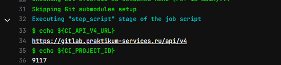

# Momo Store aka Пельменная №2


## Настройка CD 

Перед настройкой CD необходимо создать в gitlab ещё один репозиторий с чартами, исходники репозитория можно найти по ссылке: https://gitlab.praktikum-services.ru/std-ext-011-46/momo-store-chart 
В качестве деплой-мэнеджера был выбран helm., поэтому все задачи связанные с деплоем приложения делегированы в тот репозиторий.
При создании репозитория с чартами автоматически запустится первый пайлайн, в логах первой джобы нужно найти значения для наших переменных, которые мы используем в этом проекте для подключения хуков. С помощью этого мы настроем процесс непрерывного развёртывания.
Вот так могут выглядит в логах эти переменные:


Добавим их в секреты этого проекта (CI/CD->Variables):
"CHART_PROJECT_ID":"9117"
"CHART_PROJECT_API_V4_URL": "https://gitlab.praktikum-services.ru/api/v4"

Так же в репозитории с чартами необходимо создать специальный токен https://gitlab.praktikum-services.ru/help/ci/triggers/index
(CI/CD->Pipeline trigger tokens->Add new token)
Этот токен необходимо скопировать и добавить в секреты этого репозитория:
"CHART_PROJECT_TRIGGER_TOKEN":"glptt-***"

## Frontend

```bash
npm install
NODE_ENV=production VUE_APP_API_URL=http://localhost:8081 npm run serve
```

## Backend

```bash
go run ./cmd/api
go test -v ./... 
```

## code quality 

1. generate test coverage:
```bash
go test -coverprofile=coverage.out ./...
``` 
2. add sonarqube quality gate:
```bash
sonar-scanner -Dsonar.go.coverage.reportPaths=coverage.out -Dsonar.qualitygate.wait=true
```

## Container registry

1. add Nexus container registry
